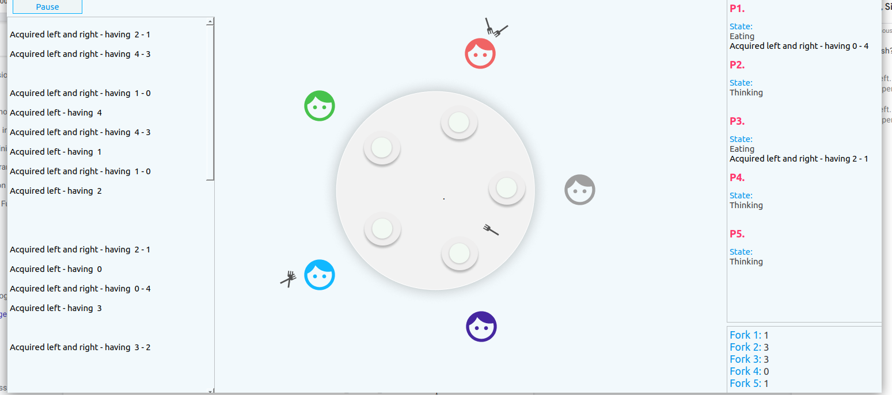

## The dining philosophers

The dining philosophers problem is an illustrative example used to demonstrate how a deadlock can occur in a system.
A solution to avoid this is included in the repo.


##### Project Structure

```

├── dining_philosopher.c  - An asymmetric solution, doesn't need any dependencies like ncurses etc.
├── naive.c - The code for the naive implementation of the solution
├── philsophers_base.h - The base library with structures
├── README.md
├── resource_hierarchy.c -  The code for the resource hierarchy solution
├── visualisation-gui/ - The QT project directory for the visualisation of UI
└── waiter_solution.c - The implementation of the waiter solution

```

#### Running a local development version

#### Pre-requisites

1. QT Creator(optional, but eases the process of downloading the required dependencies)
   Can be downloaded from QT's site  [here](https://www.qt.io/download)

2. ncurses library
   ```bash
   sudo apt-get install libncurses5-dev libncursesw5-dev
   ```

#### Instructions to run

1. Compiling the program
   To compile and run a particular solution, use
```
$  gcc <FILENAME> -lncurses -lpthread -o dine.out
   # Example:  gcc naive.c -lncurses -lpthread

$ ./dine.out
```

2. To run the GUI visualisation, open the project in `visalisation-gui` folder in the QT Creator.
   Click Run on the project.
   Please make sure that you do this after running the previous program, as it depends on it to work properly.

To simulate a deadlock, comment out the sleep function in `naive.c`.

##### Report

A detailed report on the problem can be found [here](.assets/report.pdf)

##### Preview
